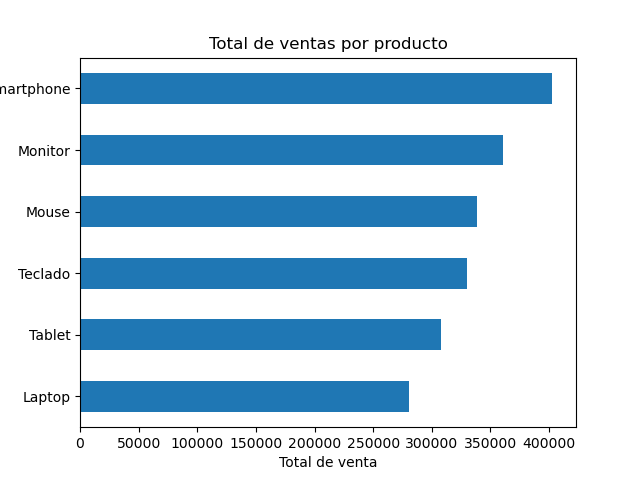
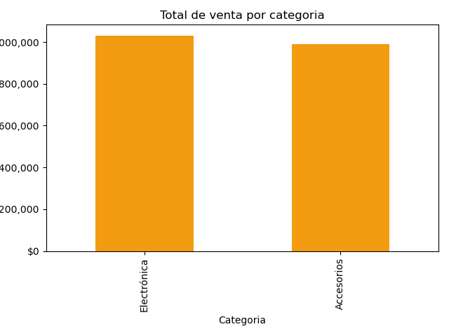
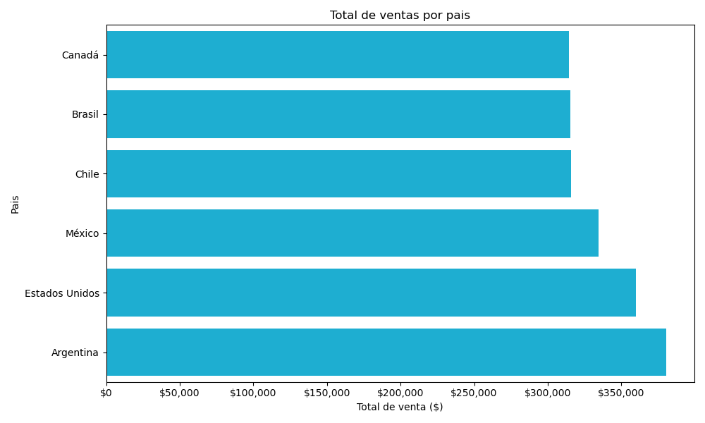

# 🛍️ Proyecto de Análisis de Ventas - EDA Completo

## 🎯 Objetivo
Analizar un dataset de ventas simuladas para extraer insights clave que apoyen decisiones comerciales, tales como:
- Identificar los productos más vendidos
- Detectar preferencias por país
- Analizar el comportamiento por categoría
- Comparar el desempeño entre regiones

Este análisis simula las operaciones de una empresa multinacional de **retail online**, permitiendo evaluar patrones de consumo y oportunidades de optimización comercial.

---

## 📦 Descripción del Dataset
- **Registros**: 2000
- **Columnas**: 8
- **Variables clave**: `Producto`, `Categoria`, `Pais`, `Precio_Unitario`, `Cantidad`, `Total_Venta`
- **Tipo de datos**: Simulados con fines educativos y analíticos

---

## 📋 Hipótesis iniciales
- Los productos tecnológicos dominarán las ventas globales.
- Países latinoamericanos mostrarán comportamientos diferenciados frente a otros mercados.
- Las categorías de mayor valor unitario no necesariamente generarán mayor volumen.

---

## 🧹 Preprocesamiento
- Eliminación de nulos y revisión de valores atípicos
- Conversión de tipos y creación de variables como `Total_Venta`
- Agrupación y filtrado para comparaciones cruzadas

---

## 🛠️ Herramientas Utilizadas
- **Python**: `pandas`, `matplotlib`, `seaborn`
- **Documentación**: R Markdown (.Rmd)
- **Visualización avanzada**: `sns.barplot()`, `heatmap`
- **Exportación de gráficas**: `.png`
- **BI Tools**: Power BI / Tableau (fase siguiente)

---

## 📊 Visualizaciones Generadas

### 🔹 Total de Ventas por Producto


### 🔹 Total de Ventas por Categoría


### 🔹 Total de Ventas por País


### 🔹 Heatmap Producto vs País


---

## 🧠 Hallazgos Clave

- **Smartphones** y **Monitores** concentran la mayor parte de las ventas.
- **Argentina**, **México** y **Estados Unidos** son los mercados con mayor actividad.
- Las categorías **Electrónica** y **Accesorios** están en empate técnico en volumen total.
- Las **laptops** sorprendentemente tienen bajo rendimiento.
- El **70% de las ventas** proviene de menos del **40% del catálogo**, sugiriendo productos estrella.

---

## 🧭 Aplicaciones prácticas
- Optimización de stock e inventario en productos de alto desempeño
- Foco en mercados regionales con mayor retorno
- Estrategias de promoción para productos con bajo volumen pero alto valor unitario
- Segmentación personalizada por categoría y país

---


## Estructura del Proyecto

```
/Semana_2/
├── EDA_ventas.ipynb
├── EDA_ventas.Rmd
├── README.md
├── /img/
│   ├── ventas_por_producto.png
│   ├── ventas_por_categoria.png
│   ├── ventas_por_pais.png
│   └── heatmap_venta_producto_pais.png
```

---

## 👤 Autor
**Miguel Ángel Castillo Sánchez**  
Proyecto desarrollado como parte de un entrenamiento personal intensivo en Ciencia de Datos (EDA + visualización + BI).

---

## 🔜 Próximos pasos
- 🔧 Construcción de dashboard interactivo en **Power BI** y **Tableau**
- 🚀 Publicación del proyecto en **Kaggle** y **GitHub** como parte del portafolio

---